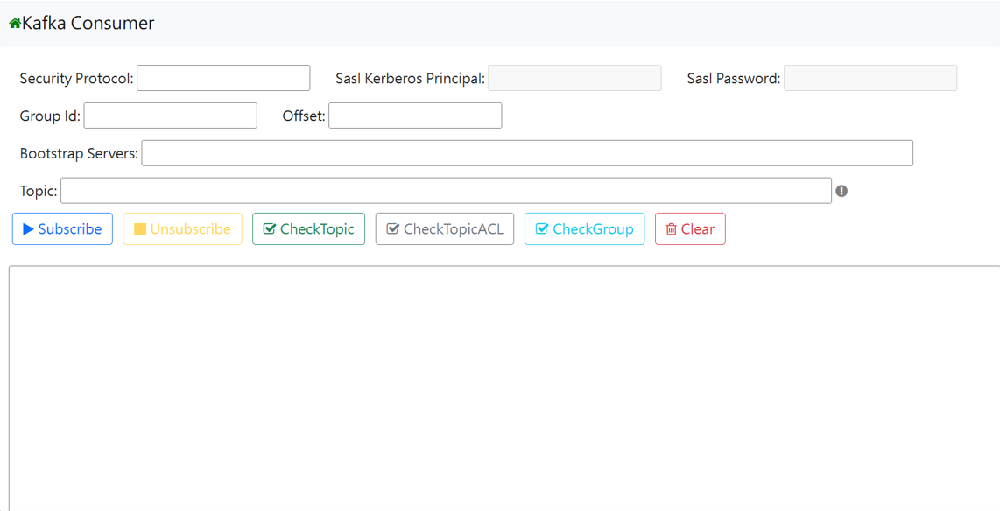
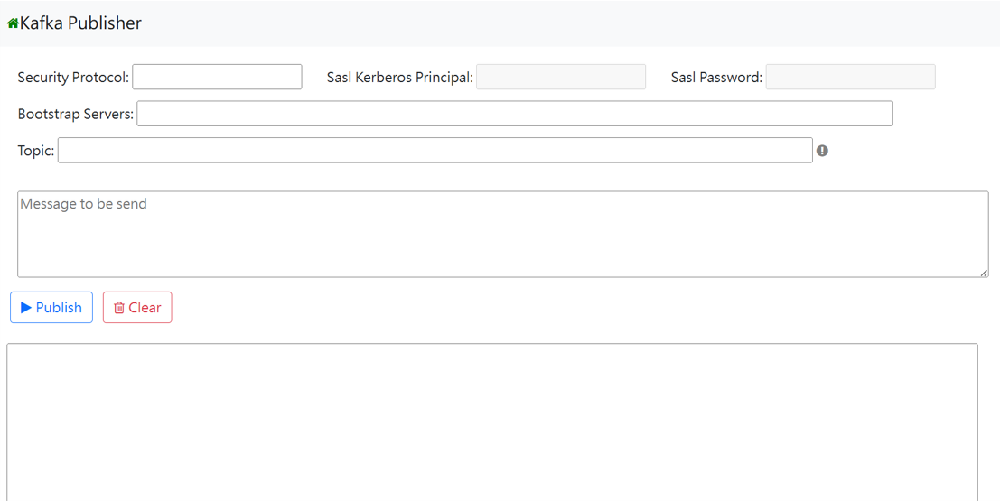

# Kafka_Tool
Lightweight web tool for real-time data streaming, built with confluent-kafka-python.

## Quick Start

### 1. Install [Docker](https://www.docker.com/)
### 2. Run run_kafka_tool.bat
       This will automatically check if Docker is installed on your computer. If it is, it will proceed with the following commands in sequence:
       (1) docker image build -t kafka-tool:test ./
       (2) docker run -p 8080:5000 kafka-tool:test
       (3) start http://localhost:8080/templates/kafkaConsumer.html
### 3. Installation and startup successful
       Access the kafka tool through http://localhost:8080/templates/index.html

## Introduction

This is a lightweight Kafka tool that provides Consumer and Publisher functionality. The tool supports both `PLAINTEXT` and `SASL_PLAINTEXT` security protocols, with `SASL_PLAINTEXT` using `GSSAPI`. When selecting `SASL_PLAINTEXT`, you need to enter the corresponding SASL principal and password to successfully connect to the bootstrap server.

### Consumer

| Buttons | Functions |
| ------- | ------- |
| Subscribe  | Start consuming the topic  |
| Unsubscribe  | Stop consuming the topic  |
| CheckTopic  | List all partitions in the topic along with their latest offsets, earliest offsets, committed offsets, and latency  |
| CheckTopicACL  | List Access Control Lists (ACLs) for the topic  |
| CheckGroup  | List all topics subscribed to by the group ID  |
| Clear  | Reset all inputs  |

### Publisher

| Buttons | Functions |
| ------- | ------- |
| Publish  | Publish message to topic  |
| Clear  | Reset all inputs  |

##
